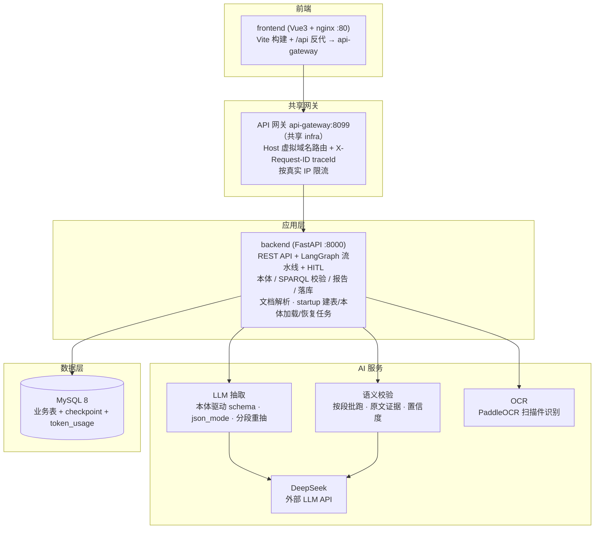

# AI 合同校验系统（contract-check）

> **本体驱动 + 大模型抽取 + 混合校验 + 人工审核闭环**的合同智能审查系统：上传合同（PDF / Word / 扫描件），自动抽取为结构化标准数据，按本体定义的规则做确定性 + 语义双重校验，全量落库并进入人工审核闭环，最终输出校验报告。

本系统是**生产级演示项目**：共享 infra + 2 应用服务一键启动、11 个场景演示合同开箱即演示、392 项单元测试全绿、本体驱动的规则集版本化可回溯、评测契约（B.4）对接标准平台。

---

> ## ⚠️ 前置依赖：共享 infra
>
> 本 agent **不自带任何中间件**，运行前须先部署共享 infra（MySQL 等）。
>
> ```bash
> # 发布物：clone infra 独立仓库后启动
> git clone https://github.com/zhanggy1984/share-infra && cd infra && docker compose up -d
> # 本地开发：infra 位于 ../infra
> cd ../infra && docker compose up -d
> ```

## 目录

- [一、项目简介：解决什么痛点](#一项目简介解决什么痛点)
- [二、业务价值：给谁带来什么](#二业务价值给谁带来什么)
- [三、技术闪光点](#三技术闪光点)
- [四、系统架构](#四系统架构)
- [五、技术栈一览](#五技术栈一览)
- [六、快速开始（3 步跑起来）](#六快速开始3-步跑起来)
- [七、演示场景与合同库](#七演示场景与合同库)
- [八、目录结构](#八目录结构)
- [九、测试与验收](#九测试与验收)
- [十、开发指南](#十开发指南)
- [十一、运维与故障恢复](#十一运维与故障恢复)
- [十二、常见问题](#十二常见问题)

---

## 一、项目简介：解决什么痛点

合同审查是**高频、重复且容错要求高**的业务：

- **人工核对费时**：一份合同条款多、规则杂，法务逐条翻阅核对，标准靠经验而难以统一；
- **判定口径不一**：同一条款不同法务判定结论可能相反，缺少可复现的规则依据；
- **原文难追**：校验结论必须有原文证据支撑，不能凭 LLM "印象"下结论；
- **流程难审计**：抽取结果、校验依据、人工确认过程散落各处，取证困难。

本系统把"合同原文 → 结构化数据 → 规则校验 → 人工复核 → 报告"全流程自动化，针对以上痛点提供四个核心能力：

| 能力 | 实现 | 对应痛点 |
|------|------|---------|
| **智能抽取** | 本体驱动 JSON Schema → DeepSeek 抽取标准文本 JSON + RDF 实例 + 文本分段 | 结构化费时 |
| **混合校验** | 确定性规则（SPARQL）抓字段级问题 + 语义规则（LLM + 原文证据）抓条款级问题 | 判定口径统一 |
| **人工审核闭环** | LangGraph 官方 human-in-the-loop，人工确认结果决定任务终态 | 结论可追责 |
| **报告导出** | PDF / Excel 中文报告（抽取摘要 + 校验明细 + 违规 + 证据） | 审计取证 |

> 定位：单用户内网部署。**文档解析完全本地**（拒绝 MinerU 等外部解析 API），但抽取与语义校验的合同内容会外发 DeepSeek（详见「对数据安全」的数据出域边界），部署前请确认合规。

---

## 二、业务价值：给谁带来什么

### 对法务 / 合同管理人员
- **提效**：DeepSeek 把合同抽取为标准 JSON + RDF，规则自动预检，法务从"逐条翻阅"变为"复核确认 + 修正"；
- **规则统一**：确定性规则由本体自动生成（不手写 SPARQL），语义规则大白话命名，判定口径可复现、可版本回溯；
- **闭环留痕**：每条校验结果全量落库（含成功），异常进入人工审核，**人工确认决定终态**，结论有据可查。

### 对合规 / 审计
- **可追溯**：抽取 JSON、RDF 实例、校验明细、证据原文、人工决策全链路可查，支持 PDF / Excel 报告导出；
- **防编造**：语义证据强制为原文**精确子串**（机制级防御），不可信结果自动标 low-confidence 提示复核。

### 对数据安全
- **本地解析**：PDF / Word / 扫描件全部本地处理（PyMuPDF / python-docx / PaddleOCR），不依赖任何外部解析 API；
- **数据出域边界（如实告知）**：抽取与语义校验的合同内容**会发送至 DeepSeek（外部 LLM API）**——这是唯一对外通道，绝无其他第三方；可配置内部端点（`DEEPSEEK_BASE_URL`），服务启动时自动检测端点并对外网地址打 WARN 告警；
- **幂等去重**：sha256 唯一哈希，重复上传自动去重，孤儿文件与 checkpoint 定期清理。

### 对评测 / 集成方
- **标准契约**：`GET /api/contracts` 声明 agent 接口与场景清单（B.4），平台脚手架可**自动发现**；
- **结果契约**：`GET /api/tasks/{id}/result` 同步 JSON 透出 `answer / usage / timing / tool_calls / meta`，直接对接标准评测取数。

---

## 三、技术闪光点

### 1. 本体单一事实源
一份 OWL 合同本体（Contract / Party / Item / Clause，30+ 类、30+ 属性）同时驱动「抽取 JSON Schema」（`schema_mapper`）与「校验 SPARQL 规则」（`rule_generator`）——**换本体即换 schema + 规则集**，本体版本 md5 落库可回溯。

### 2. 混合校验：确定性 + 语义双层
- **确定性**：SPARQL 闭合世界找反例，多反例**合并单条 violation**（message 列出全部 `?s`）；
- **语义**：LLM 按段批跑，`aggregation=any/all` 粒度聚合，条款级问题带原文证据；
- PASS / FAIL / SKIPPED **全量落库（含成功）**，抽取不完整时确定性降级 SKIPPED、语义照跑（基于原文不受缺失影响）。

### 3. 官方 HITL 落地
`await_human_review` 为**纯节点**（无副作用，resume 重跑安全）；resume 用 **CAS 抢占**（`WAITING_REVIEW→REVIEWING`，rowcount=1 才放行，并发返回 409），invoke 失败幂等回退，前端按钮防重。`langgraph-checkpoint-mysql` 持久化图状态（`thread_id=task-{id}`），进程重启可恢复。

### 4. 终态语义正确
存在人工确认（CONFIRMED）的异常 → **FAILED**；全误报或零异常 → **SUCCESS**——人工审核结果真正决定任务结论，杜绝"确认了异常却显示通过"。

### 5. 证据防御
语义规则 evidence 必须为原文**精确子串**（NFKC 归一化 + 去空白，容忍 OCR 断字），不满足则带反馈重试，仍不满足标 **low-confidence**——从机制上防止 LLM 编造证据。

### 6. 取消 / 超时语义
取消白名单前后端一致；运行中任务靠节点入口 CANCELLED 短路（`TaskCancelledError`）**确定置 CANCELLED**；软超时兜底不阻塞事件循环，任一节点异常/超时 → FAILED 兜底。

### 7. 抽取健壮性
必填空串视为缺失触发 LLM 重试（防止"空串被当有值、RDF 却缺失"的语义缝隙）；输出截断自动降级分段重抽（B.4：`LengthFinishReasonError` 恢复 `content/finish_reason/usage`）；同名当事人合并、跨段字段冲突标低置信进人工。

### 8. 一致性与幂等
`rule_check_result` + `violation` **单事务写入**、`(task_id, rule_id)` 唯一键先删后插，崩溃后 resume 不重复落库；B.4 加固：死锁（MySQL 1213 / 40001）**整事务重试**，`token_usage_json` 旧库幂等补列迁移。

### 9. 数据安全
- **解析本地化**：合同原件、解析结果（文本 / OCR）仅在**本地磁盘 + MySQL**，不发送任何第三方解析服务（含 MinerU 等外部 API）；
- **LLM 外发（数据出域）**：抽取与语义校验阶段，合同文本内容发送至 `DEEPSEEK_BASE_URL` 指向的 LLM API（默认 DeepSeek 公有云）——本系统唯一的对外数据通道。服务启动时自动检测端点，外部端点打 WARN 日志提醒合规；部署内网 + 敏感合同时建议接入自建 / 内网 LLM 端点；
- **密钥管理**：DeepSeek API key / 认证口令全部经 env 注入（`backend/.env` → 容器 `env_file`，**不入镜像 / 仓库**，`.env` 已被 `.gitignore` 排除），日志不打印密钥；
- 幂等去重、孤儿文件 / checkpoint 定期清理、启动恢复未完成任务。

### 10. 评测契约（B.4）
- `GET /api/contracts`：标准契约清单端点（agent / interfaces / scenes），平台脚手架自动发现，`llm=false` 辅助接口（上传）只登记不进 agent 接口；
- `GET /api/tasks/{id}/result`：同步 JSON 契约，透出 `answer`（校验摘要，失败/取消也有语义补全）、`usage`（LLM token 全字段聚合）、`timing`（start/end，同步接口不测首字）、`tool_calls`（规则命中明细全量，含 PASS / SKIPPED）、`meta`（agent/model/interface/contract_version）；
- 配套 `verify_cc_*` 评测脚本与 `gen_cc_*` 变体合同生成器，覆盖单方签署缺陷形态、合法签署边界、电子签章等场景。

---

## 四、系统架构

### 系统拓扑（docker compose 一键部署，3 容器）



**对外链路（统一 API 网关）**：浏览器只访问前端 nginx；nginx 将 `/api` 反代到共享网关 `api-gateway:8099`（`Host: cc.local`），网关按 Host 虚拟域名路由到本 agent 后端，并生成 `X-Request-ID`（后端日志 `trace_id` 即此值）、按真实 IP 限流。网关由共享 infra 仓库提供（`infra/api-gateway/`），未知 Host 一律 403 防串线。宿主端口映射的 backend 地址（如 `localhost:8003`）仅供开发调试 / 评测直连，绕过网关。

### 校验流水线（LangGraph 状态图）

```
上传
 └► parse（解析/OCR） ─► extract（LLM 抽取 → 标准JSON + RDF + segments）
     ─► validate_deterministic（SPARQL 确定性校验）
     ─► validate_semantic（LLM 语义校验 + 原文证据）
     ─► persist（单事务幂等落库）
     ─► 条件分流：
         有异常 / 抽取不完整 ─► await_human_review（interrupt 暂停等人工）
               ─► apply_reviews（写入确认/误报）─► finalize
         零异常且完整 ─► finalize（自动 SUCCESS）
```

- 任务状态由 `check_task` 表查询；图运行状态由 `langgraph-checkpoint-mysql` 持久化（`thread_id = task-{id}`），进程重启可恢复；
- 任一节点异常 / 取消 / 超时 → 任务置 FAILED / CANCELLED 兜底。

### 四层逻辑分层（交互 → 控制 → 能力 → 资源）

代码按职责分四层，依赖单向向下：上层可依赖下层，下层绝不反向依赖上层；**交互层只经控制层访问能力/资源**。

| 层 | 职责 | 落点 |
|---|---|---|
| 交互层 | HTTP 契约 + 鉴权 + 请求解析 + 结果格式化 | `app/api/*.py`（只做路径/参数校验、状态码、响应组装；不直连 DB/解析/报告） |
| 控制层 | 任务编排 + 状态管理 + 路由 | `app/service/check_task_service.py` + `app/graph/`（LangGraph 状态机 + HITL） |
| 能力层 | 执行具体操作 | `app/tools/`（registry + executors）、`app/parser/`、`app/ocr/`、`app/validation/`、`app/report/` |
| 资源层 | 数据 / 知识 / LLM / 审计抽象 | `app/db/`、`app/ontology/`、`app/llm/`、`app/decision_recorder/`、`app/config` |

关键约束：

- **依赖单向**：交互 → 控制 → 能力 → 资源；低层不 import 上层（无环路，已验证）。
- **交互层收口**：`api/*.py` 无 `db.query`/`db.get` 直连、不 import `parser/report/db.models`——统一经
  `check_task_service` 委托（`get_task`/`get_task_result`/`render_report`/`save_uploaded_file`/
  `list_violations`/`update_violation_status` 等）。`api/rules.py` 为例外：其 CRUD 已整体委托
  `rule_service(db, ...)`（控制层），`get_db` 仅作 DI 注入点，无直连查询。
- **能力接口**：工具经 `tools/registry.py` + `executors.py` 统一暴露，图节点只经此层访问能力。
- **LLM 客户端**：`llm/llm_client.get_chat_model()` 惰性单例（lru_cache），全进程共享一个 ChatOpenAI。

### 状态与记忆

- **对话状态 = 单任务流水线状态**：由 `check_task` 表（status/progress/error）+ LangGraph checkpoint
  （`thread_id = task-{id}`，进程重启可续跑）共同表示。本项目是"单合同 → 流水线"模式，不维护多轮对话上下文。
- **记忆 = 知识 + 历史 + 审计**三部分：
  - 知识：`app/ontology/`（本体 / 规则，单一事实源）；
  - 历史：`app/db/`（任务、合同文件、violation、校验结果落库）；
  - 审计：决策痕迹（function calling 决策引擎 → `decision_json`）+ LLM token 用量（`token_usage_json`）落库。

---

## 五、技术栈一览

| 域 | 选型 |
|----|------|
| 编排 | LangGraph（官方 human-in-the-loop）+ langgraph-checkpoint-mysql（锁版本） |
| 后端 | Python 3.11 + FastAPI + SQLAlchemy 2.0 + PyMySQL |
| LLM | DeepSeek（langchain-openai，json_mode，max_tokens 8192，429 退避，截断恢复） |
| 本体 | owlready2（OWL/RDF，版本 md5 落库）+ rdflib 执行 SPARQL（版本显式钉死） |
| 解析 | PyMuPDF（PDF）、python-docx（Word）、PaddleOCR 3.x（扫描件，置信度阈值 + 失败降级） |
| 前端 | Vue3 + Vite + Element Plus + axios（轮询任务状态） |
| 报告 | reportlab（PDF，中文字体 bundle）+ openpyxl（Excel） |
| 测试 | unittest（backend，392 项全绿） |

---

## 六、快速开始（3 步跑起来）

> 前置：Docker Desktop（Linux 容器）。
> **共享 infra**：本 agent 不自带任何中间件（仅依赖共享 infra 的 MySQL）。启动前先部署 infra（见 infra 仓库 README：`docker compose up -d`）。

### 第 1 步：配置环境变量

- 项目根 `.env`：`MYSQL_DATABASE`/`MYSQL_USER`/`MYSQL_PASSWORD`（共享 infra 的 `contract_check` 库账号；`MYSQL_HOST`/`MYSQL_PORT` 已由 compose 固定为逻辑主机名 `mysql`/3306）；
- `backend/.env`：DeepSeek 配置（本地文件，不入镜像）：

```
DEEPSEEK_API_KEY=sk-xxx
DEEPSEEK_BASE_URL=https://api.deepseek.com
DEEPSEEK_MODEL=deepseek-chat
```

### 第 2 步：启动应用容器（backend + frontend）

```bash
docker compose up -d --build
docker compose ps                 # contract-check-backend / contract-check-frontend 全部 Up + healthy
# 快捷方式（同一命令封装）：./start.sh（Linux）或 powershell start.ps1（Windows）
```

> 本 agent 只起应用容器；中间件仅 MySQL（共享 infra 的 `contract_check` 库）。

### 第 3 步：生成演示合同

```bash
python data/gen_demo_contracts.py   # 11 个场景演示合同 → data/test-contracts/（需中文字体，跨平台自动查找）
```

**跑起来了**：

| 地址 | 说明 |
|------|------|
| http://localhost:8088 | 前端（Vue3 工作台） |
| http://localhost:8003 | 后端 API（OpenAPI 文档 `/docs`） |
| localhost:33061 | MySQL（共享 infra，库 `contract_check`） |

> **端口覆盖**：宿主端口固定（前端 8088 / 后端 8003），如需改动 `docker-compose.yml` 的 `ports` 即可；中间件端口由共享 infra 管理。

停止（保留数据卷）：`docker compose down`（或 `stop.ps1`）。

---

## 七、演示场景与合同库

`data/gen_demo_contracts.py` 一键生成 11 个场景演示合同到 `data/test-contracts/`（PDF 体积大不入库，clone 后先运行生成脚本）。上传对应合同即可触发对应校验结果：

| 文件 | 场景 | 预期校验结果 |
|------|------|-------------|
| good.pdf | 合规合同 | 零/少量 violation → SUCCESS |
| b1_missing_date.pdf | 缺生效日期 | 必填 FAIL（required） |
| b2_negative_amount.pdf | 合同金额为负 | 数值下限 FAIL（min） |
| b3_bad_type.pdf | 合同类型越界 | 枚举 FAIL |
| b4_missing_party_b.pdf | 缺乙方主体 | 人工规则 FAIL |
| b5_termination_before_effective.pdf | 终止早于生效 | 人工规则 FAIL |
| b6_missing_breach_clause.pdf | 缺违约责任条款 | 语义 FAIL（aggregation=all） |
| b7_unbalanced_obligations.pdf | 权利义务不对等 | 语义 FAIL（evidence 命中原文 → 高置信） |
| b8_service_contract.pdf | 纯服务合同无标准引用 | 技术标准规则 SKIPPED；但无违约条款 → 语义 FAIL |
| long_contract.pdf | 超 20k 字符 | 分段抽取合并（同名当事人去重） |
| scanned.pdf | 扫描件（无文本层） | 触发 OCR（A3） |

**演示建议**：先传 `good.pdf` 展示全流程走通；再传 `b1/b2/b6/b7` 展示异常进入人工审核闭环与置信度标注；`scanned.pdf` 展示 OCR 能力；`long_contract.pdf` 展示分段抽取与冲突低置信。

**单方签署专项变体**（7.8 薄弱点验证，`gen_cc_*.py` 生成 + `verify_cc_*.py` 验证）：

| 脚本 | 验证点 | 结果期望 |
|------|--------|---------|
| verify_cc_variants.py | single_party 对 v0-v3 缺陷形态（下划线占位 / 冒号后为空 / 缺签署区 / 混合） | 缺陷全部检出、good 无误报 |
| verify_cc_legal_variants.py | l1-l7 合法签署形态（电子签章 / 仅签字 / 公章 + 签字 / 无冒号） | 合法 SUCCESS + 0 违规、缺方检出 |
| verify_cc_m_variants.py | m1-m7 签署形态边界（授权代表 / 仅法定代表人 / 电子签章 CA / 空白占位） | 合法 SUCCESS + 0 违规、m6/m7 检出 |
| verify_cc_e2e.py | B.4 评测契约字段（answer / usage / timing / tool_calls）+ 评测后清理 | 契约全字段达标 |

---

## 八、目录结构

```
contract-check/
├── backend/                  # 后端源码（FastAPI + LangGraph）
│   ├── app/
│   │   ├── main.py           # 应用入口（建表 / 补列 / 本体加载 / 恢复任务）
│   │   ├── api/              # REST 路由（files/tasks/violations/rules/contracts）
│   │   │   └── contracts.py  # B.4 标准契约清单端点（agent/interfaces/scenes）
│   │   ├── graph/            # LangGraph：build / nodes / state（HITL 流水线）
│   │   ├── llm/              # llm_client（json_mode/截断恢复）+ extractor（抽取/分段重抽）
│   │   ├── ontology/         # contract_ontology.ttl + loader / schema_mapper / rule_generator
│   │   ├── validation/       # sparql_executor / semantic_evaluator / persist（单事务落库）
│   │   ├── service/          # check_task_service（状态机/恢复/交互层收口）+ rule_service（规则管理）
│   │   ├── parser/           # PDF / Word 解析
│   │   ├── ocr/              # PaddleOCR 服务
│   │   ├── report/           # PDF（reportlab）/ Excel（openpyxl）报告
│   │   └── common/ db/       # 常量 / DB session、models 与序列化（serializers）
│   ├── rules/manual/         # 人工规则：3 条 SPARQL（缺甲方/缺乙方/终止早于生效）
│   │                          #           + 4 条语义 JSON（缺违约条款/权利义务不对等/技术标准/单方签署）
│   ├── tests/                # 393 项单元测试
│   ├── scripts/              # 验收/冒烟/PDF 生成脚本
│   ├── requirements*.txt / Dockerfile / entrypoint.sh / fonts/
├── frontend/                 # 前端（Vue3 + Vite + Element Plus）
│   ├── src/views/            # Workbench（上传+任务）/ History（历史+报告）/ Rules（规则管理）
│   └── nginx.conf            # /api 反代
├── data/
│   ├── gen_demo_contracts.py # 11 个场景演示合同生成器（随仓库发布，PDF 不入库）
│   └── test-contracts/       # 演示合同 + gen_cc_* 变体生成器 + verify 结果 JSON
├── docker-compose.yml        # 3 容器编排（mysql+backend+frontend）
├── docker-compose.override.yml  # 本地端口覆盖（8088/8003，用户确认保留，不入库）
├── verify_cc_e2e.py          # B.4 评测契约 e2e 验证
├── verify_cc_variants.py     # single_party 缺陷形态验证
├── verify_cc_legal_variants.py / verify_cc_m_variants.py  # 签署边界验证
├── start.ps1 / start.sh / stop.ps1  # 一键启动/停止
├── solution.md               # 技术方案（架构设计、数据模型、API 契约）
├── task.md                   # 任务拆分与验收标准（T0-T4 + A-H 端到端）
└── README.md
```

---

## 九、测试与验收

### 单元测试（393 项全绿）

```bash
cd backend
.venv/Scripts/python.exe -m unittest discover -s tests -p "test_*.py"
```

| 覆盖域 | 测试文件 |
|--------|---------|
| 抽取健壮性 / LLM 调用 | test_defensive_paths.py / test_llm_call_json.py |
| 校验落库 / 语义评估 / 聚合 | test_persist.py / test_sparql_executor.py / test_semantic_evaluator.py / test_nodes_persist.py / test_usage_aggregation.py |
| 审核闭环 / 取消 / 超时 / 删除 | test_finalize.py / test_task_cancel.py / test_task_timeout.py / test_delete_task.py |
| 评测契约 / 迁移 / 服务层 | test_contract_result.py / test_main_migrate.py / test_task_service.py |
| 规则管理 / 报告 / 文件清理 | test_rule_service.py / test_report.py / test_file_cleanup.py |

### 端到端验收（task.md A-H 场景全覆盖）

- **A 正常路径**：文本 PDF / Word / 扫描件 OCR / 短合同 / 长合同分段抽取
- **B 校验命中**：缺日期 / 负金额 / 类型越界 / 缺乙方 / 终止早于生效 / 缺违约条款 / 权利义务不对等 / 不适用 SKIPPED / 合规零违规 / 单规则多反例合并
- **C 人工审核**：确认 / 误报 / 混合 / 部分提交拒绝 / 双击 409 / resume 失败回退 / cancel 三种状态
- **D 抽取稳定性**：空结果 / 部分缺失降级 / 输出截断重抽 / 非法 JSON 重试 / 429 退避
- **E 一致性恢复**：结果与 violation 一致 / 崩溃幂等 / 重启恢复 / checkpoint 清理
- **F 文件边界**：50MB 上限 / 非支持格式拒绝 / 旧版 .doc 拒绝 / 损坏文件 FAILED / sha256 去重 / 并发隔离
- **G 报告历史**：PDF / Excel 导出中文正常 / 分页筛选详情
- **H 安全部署**：.env 不入库 / 纯本地解析 / 一键 compose 启动

---

## 十、开发指南

### 环境

```bash
# 后端
cd backend
pip install -r requirements.txt            # 或 requirements-dev.txt
uvicorn app.main:app --reload --port 8001  # 需本机 MySQL + .env

# 前端
cd frontend
npm install
npm run dev                                # Vite 开发服务器，/api 已反代
```

### 测试 / 验收

- 单测：`cd backend && .venv/Scripts/python.exe -m unittest discover -s tests -p "test_*.py"`；
- 评测契约：宿主直连容器后端 `verify_cc_e2e.py`（注意 `trust_env=False` 防系统代理撞 502）；
- 提交前跑全量单测，确保不破坏既有测试。

### 新增规则

- **确定性规则**：由本体自动生成（用户不手写 SPARQL）；人工追加写 `backend/rules/manual/*.rq`；
- **语义规则**：新建规则仅支持语义 LLM 类型，写 `backend/rules/manual/*.json`（`rule_name` 大白话、`aggregation` any/all）；rule_iri 自动生成（冲突自动加后缀）；
- 删除保护：被历史校验记录引用的规则禁止删除，改用「失效」；本体规则不可删。

### 数据库变更

- 表结构由 `backend/app/db/schema.sql` + `create_all` 维护；B.4 后新增列走 `_ensure_column` 幂等补列（如 `check_task.token_usage_json`）；
- 容器改动需 `docker compose build backend` 重建镜像（`app/` 未做卷挂载，改动不热更新）。

### 编码规范

- 4 空格缩进；注释写"为什么"不写"做什么"，public 契约写 what；中文注释、英文标识符；
- 新增接口/消费者打印入参出参（debug 级）；核心逻辑（Service 业务分支 + 关键异常路径）必须单测覆盖。

---

## 十一、运维与故障恢复（单用户内网最小运维集）

定位：单用户内网真实使用，运维只覆盖「数据不丢、能恢复、不被拖垮」三件事，不引入监控 / 告警 / 多实例。

### 每日备份（必做）

- 脚本：`backend/scripts/backup_mysql.sh`（Linux / Git Bash）与 `backend/scripts/backup_mysql.ps1`（Windows）；
- 产物：`data/backups/contract_check_YYYYmmdd_HHMMSS.sql.gz`，自动保留最近 **14** 份（`KEEP` 可调）；
- 凭证：自动读共享 infra 的 `infra/.env`（`MYSQL_CONTRACT_USER / MYSQL_CONTRACT_PASSWORD`），仓库不存凭据；
- 定时：Windows 任务计划程序 / crontab 每日跑一次；gzip 在容器内完成，宿主机无需安装；
- 已验证：手动跑通，10 张业务表 + 数据可完整还原到临时库。

### 恢复

```bash
# 1. 停 backend（避免写库竞争）
docker compose stop backend
# 2. 覆盖还原到 contract_check（建议先备份当前库）
gzip -dc data/backups/contract_check_XXX.sql.gz | docker exec -i shared-mysql sh -c 'mysql -uroot -p"$MYSQL_ROOT_PASSWORD" contract_check'
# 3. 重启
docker compose up -d
```

> 注意：`contract` 账号仅有 `contract_check` 库权限，覆盖还原需用 infra root（`infra/.env` 的 `MYSQL_ROOT_PASSWORD`）。

### 任务并发限制

- 配置：`MAX_CONCURRENT_TASKS`（默认 **3**）——同时运行的校验流水线数上限，防连传大量合同 → 数十条 LLM 流水线并发；
- 行为：超限任务排队等待空位、不拒绝；人工审核 resume 是同步短跑，不受此限。

### 崩溃恢复成本

- 进程崩溃 / 重启后，`PENDING / PARSING / EXTRACTING / VALIDATING` 任务自动续跑——同 LangGraph thread_id 从最后 checkpoint 继续，**非从图起点重跑**；
- 抽取 / 语义节点带**崩溃重放守卫**（T4.3-5）：结果先落库快照，重放读快照复用、**不再调 LLM**（防重复计费，见 `tests/test_llm_reuse.py`）；
- 结论：崩溃恢复几乎不产生额外 LLM 成本，仅重跑 parse 等本地廉价节点。

### 健康检查与日志

- 探针：`curl http://127.0.0.1:8003/api/health` 返回 `{"status":"ok","auth_required":true}`（容器内 `:8000`）；
- 日志：`docker compose logs -f backend`；启动时可见鉴权缺失 / LLM 外发 WARN（见「对数据安全」）。

---

## 十二、常见问题

| 现象 | 处理 |
|------|------|
| 前端 80 / 后端 8001 起不来 | 宿主被 rag-nginx / rag-attu 占用 → 用 `docker-compose.override.yml` 改 8088 / 8003（`!override` 整体替换） |
| MySQL 宿主 3306 冲突 | 被 smart-procurement `sp-mysql` 占用 → compose 已改宿主 3307（容器内 backend 连 `mysql:3306` 不变） |
| 校验不命中预期规则（如 b3 类型越界 / b4 缺乙方） | 依赖 LLM 如实抽取，LLM 可能做宽松枚举映射/推断乙方存在，多传几次即可（详见 `data/test-contracts/README.md`） |
| `answer` 为空或评测不达标 | B.4 后 answer 已对 FAILED/CANCELLED/WAITING_REVIEW/非终态做语义补全，确保非空；仍为空查 LLM token 是否写入 `token_usage_json` |
| OCR 首次很慢 | 首次启动需下载 PaddleOCR 模型（`TASK_TIMEOUT_SECONDS=1800` 已预留），等 backend healthy 后再传扫描件 |
| DeepSeek 抽取出错 / 429 | 检查 `backend/.env` 的 `DEEPSEEK_API_KEY`；429 已自动退避重试 |
| 评测脚本连 localhost 502 | 宿主系统代理（Clash 等）会劫持内网请求 → 脚本统一 `trust_env=False` 直连 |
| 演示合同 PDF 乱码/缺失 | 先运行 `python data/gen_demo_contracts.py`（需中文字体，找不到会明确报错） |
| 演示数据被污染 | 删除 `data/test-contracts/` 下 PDF 后重跑生成脚本（幂等） |

---

## 文档索引

- **技术方案**：[solution.md](solution.md)（架构设计、数据模型、本体与规则、API 契约、风险控制）
- **任务拆分与验收**：[task.md](task.md)（T0-T4 逐项任务 + A-H 端到端验收标准）
- **演示合同库说明**：[data/test-contracts/README.md](data/test-contracts/README.md)（各场景合同与预期校验结果）
